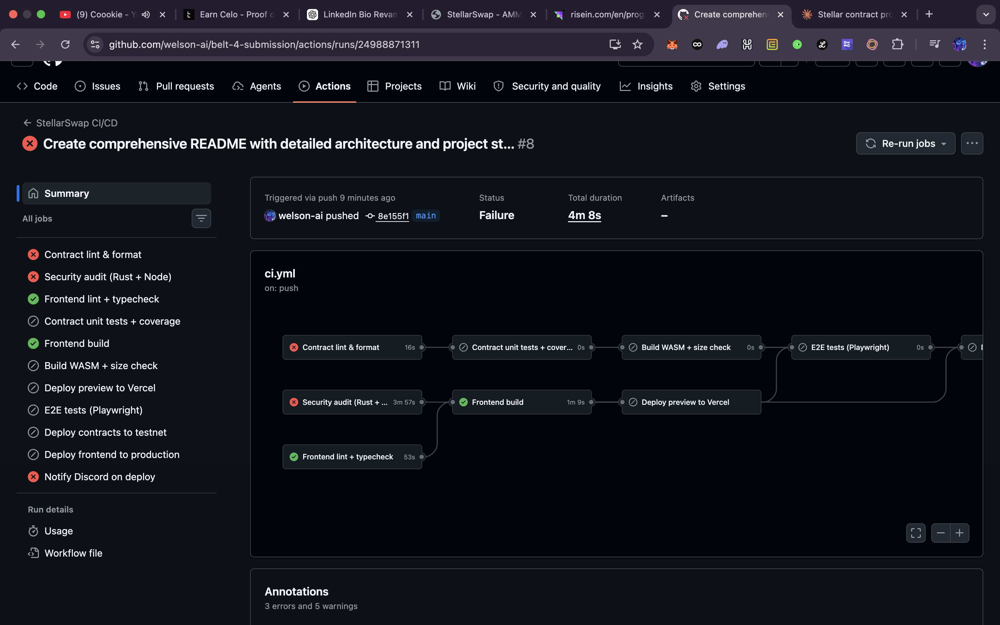
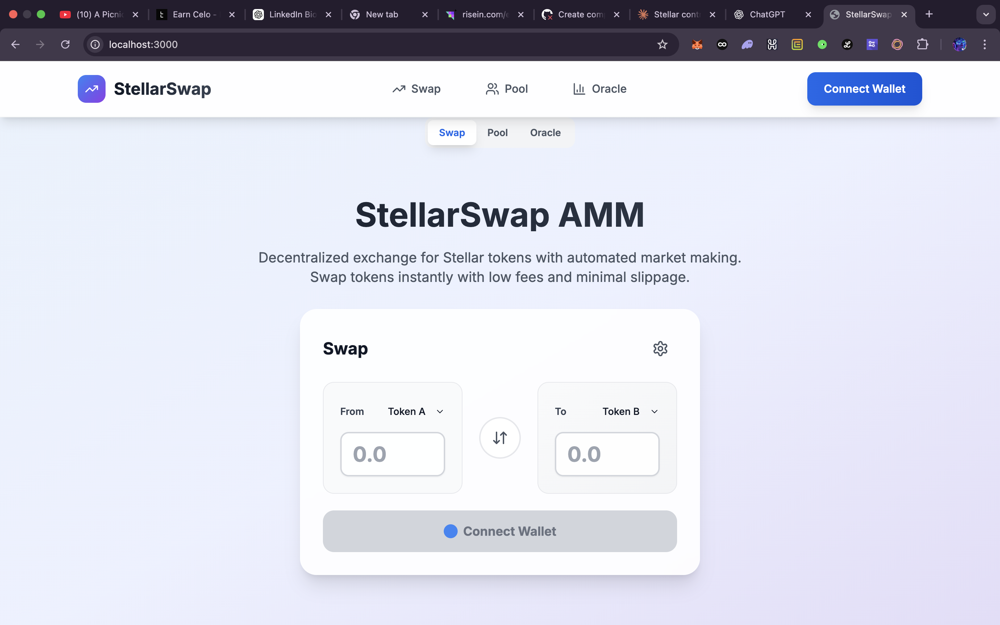
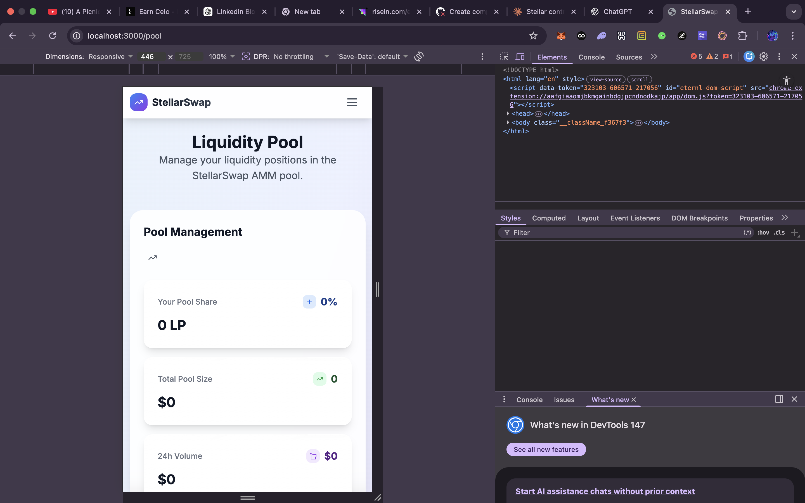

# StellarSwap - AMM DEX on Stellar


A production-ready Automated Market Maker (AMM) decentralized exchange built on Stellar using Soroban smart contracts.

# Submisssion requirements
## website url
https://stellar-swap6.vercel.app/
## CI/CD pipeline running

 

## Desktop view 
 

## Mobile View
 


## Features

- **Constant Product AMM**: Uniswap V2 style x * y = k formula
- **Low Fees**: Only 0.3% trading fee
- **TWAP Oracle**: Time-weighted average price oracle for reliable price feeds
- **Inter-Contract Calls**: Seamless integration between contracts
- **Mobile Responsive**: Beautiful UI that works on all devices
- **Non-Custodial**: Users maintain control of their funds
- **Freighter Integration**: Easy wallet connection

## Architecture Overview

StellarSwap is built with a modular architecture consisting of three interconnected smart contracts and a modern web frontend:

```
┌─────────────────┐    ┌─────────────────┐    ┌─────────────────┐
│   LP Token      │    │   AMM Pool      │    │  Price Oracle   │
│   Contract      │◄──►│   Contract      │◄──►│   Contract      │
└─────────────────┘    └─────────────────┘    └─────────────────┘
         │                       │                       │
         │                       │                       │
         └───────────────────────┼───────────────────────┘
                                 │
                         ┌─────────────────┐
                         │   Frontend      │
                         │   (Next.js)     │
                         └─────────────────┘
```

### System Architecture

The DEX follows a layered architecture pattern:

1. **Smart Contract Layer**: Core DeFi logic on Stellar blockchain
2. **Integration Layer**: Contract-to-contract communication
3. **Application Layer**: User interface and wallet integration
4. **Infrastructure Layer**: Deployment, testing, and CI/CD

## Project Structure

```
belt-4-submission/
├── contracts/                    # Soroban smart contracts
│   ├── lp_token/               # Liquidity provider token contract
│   │   ├── src/
│   │   │   └── lib.rs         # Main contract implementation
│   │   └── Cargo.toml          # Contract dependencies
│   ├── amm_pool/               # Main AMM pool contract
│   │   ├── src/
│   │   │   └── lib.rs         # Pool logic and swap calculations
│   │   └── Cargo.toml
│   ├── price_oracle/           # TWAP price oracle contract
│   │   ├── src/
│   │   │   └── lib.rs         # Price tracking and TWAP calculations
│   │   └── Cargo.toml
│   └── integration-tests/      # Cross-contract integration tests
│       ├── src/
│       │   └── lib.rs
│       └── Cargo.toml
├── frontend/                    # Next.js web application
│   ├── app/                    # App Router structure
│   │   ├── layout.tsx          # Root layout component
│   │   ├── page.tsx            # Home/swap page
│   │   ├── pool/               # Pool management pages
│   │   └── oracle/             # Price oracle pages
│   ├── components/             # Reusable UI components
│   │   ├── SwapCard.tsx        # Swap interface component
│   │   ├── PoolCard.tsx        # Liquidity management
│   │   └── OracleChart.tsx     # Price visualization
│   ├── lib/                    # Utility libraries
│   │   ├── stellar.ts          # Stellar SDK wrappers
│   │   └── contracts.ts        # Contract interaction helpers
│   ├── tests/                  # E2E tests with Playwright
│   │   └── basic.spec.ts       # Core user flow tests
│   ├── package.json            # Frontend dependencies
│   └── tailwind.config.ts      # Tailwind CSS configuration
├── scripts/                    # Deployment and utility scripts
│   └── deploy.sh               # Contract deployment script
├── .github/                    # GitHub Actions CI/CD
│   └── workflows/
│       └── ci.yml              # Continuous integration pipeline
├── Cargo.toml                  # Rust workspace configuration
├── Cargo.lock                  # Dependency lock file
└── README.md                   # This documentation
```

## Smart Contracts

### 1. LP Token Contract (`contracts/lp_token/`)

**Purpose**: ERC-20 style liquidity provider token contract

**Key Features**:
- Standard token interface (balance, transfer, allowance)
- Access control: Only AMM Pool contract can mint/burn
- Events: Emits events for all token operations
- Security: Reentrancy protection and input validation

**Core Functions**:
- `initialize(admin, name, symbol, decimals)` - Setup token metadata
- `mint(to, amount)` - Create new LP tokens (pool only)
- `burn(from, amount)` - Destroy LP tokens (pool only)
- `transfer(from, to, amount)` - Transfer tokens between accounts
- `approve(owner, spender, amount, expires_at)` - Set spending allowances
- `balance(id)` - Get account balance
- `allowance(from, spender)` - Get allowance amount

**Security Features**:
- Access control through admin pattern
- Expiration-based allowances
- Event logging for transparency

### 2. AMM Pool Contract (`contracts/amm_pool/`)

**Purpose**: Core automated market maker implementing constant product formula

**Key Features**:
- Constant product AMM: x * y = k
- 0.3% swap fee (30 basis points)
- Inter-contract calls to LP token and oracle
- Slippage protection
- Price impact calculations

**Core Functions**:
- `initialize(token_a, token_b, lp_token, oracle)` - Setup pool configuration
- `add_liquidity(user, amount_a, amount_b, min_lp)` - Add liquidity to pool
- `remove_liquidity(user, lp_amount, min_a, min_b)` - Remove liquidity
- `swap(user, token_in, amount_in, min_out)` - Execute token swap
- `get_price(token_in, amount_in)` - Calculate swap output
- `get_reserves()` - Get current pool reserves
- `get_pool_info()` - Get pool configuration

**Mathematical Model**:
```
Constant Product: x * y = k
Swap Formula: amount_out = (amount_in * reserve_out) / (reserve_in + amount_in)
Fee Calculation: amount_in_with_fee = amount_in * (10000 - 30) / 10000
LP Token Calculation: lp_amount = sqrt(amount_a * amount_b)
```

**Security Features**:
- Integer overflow/underflow protection
- Minimum output validation
- Access control for critical operations
- Oracle integration for price recording

### 3. Price Oracle Contract (`contracts/price_oracle/`)

**Purpose**: Time-weighted average price (TWAP) oracle for reliable price feeds

**Key Features**:
- TWAP calculations over configurable time windows
- Price history storage (up to 100 snapshots)
- Symmetric price pair handling
- Cumulative price tracking

**Core Functions**:
- `initialize(admin)` - Setup oracle with admin
- `record_price(token_a, token_b, price, timestamp)` - Record price snapshot
- `get_latest_price(token_a, token_b)` - Get most recent price
- `get_twap(token_a, token_b, period)` - Calculate TWAP over period
- `get_price_history(token_a, token_b, limit)` - Get historical prices

**TWAP Algorithm**:
```
cumulative_price += price * time_delta
twap = cumulative_price / time_window
```

**Security Features**:
- Admin-only price recording
- Time window validation
- History limit enforcement

## Frontend Architecture

### Technology Stack

- **Framework**: Next.js 14 with App Router
- **Language**: TypeScript for type safety
- **Styling**: Tailwind CSS for utility-first styling
- **Blockchain**: @stellar/stellar-sdk for contract interaction
- **Wallet**: @stellar/freighter-api for wallet integration
- **Testing**: Playwright for end-to-end testing

### Application Structure

**Pages**:
- `/` - Main swap interface with real-time price calculation
- `/pool` - Liquidity management (add/remove liquidity)
- `/oracle` - Price charts and historical data visualization

**Components**:
- `SwapCard.tsx` - Token swap interface with slippage control
- `PoolCard.tsx` - Liquidity provision and removal interface
- `OracleChart.tsx` - Price history visualization
- `WalletConnect.tsx` - Freighter wallet integration

**State Management**:
- React hooks for local state
- Stellar SDK for blockchain state
- Real-time price updates via contract events

### Key Features

**Swap Interface**:
- Real-time price calculation
- Slippage tolerance settings
- Price impact warnings
- Transaction confirmation flow

**Liquidity Management**:
- Dual-token input validation
- LP token calculation preview
- Minimum liquidity protection
- Fee estimation

**Price Oracle**:
- Interactive price charts
- TWAP visualization
- Historical price data
- Time period selection

## Development Workflow

### Prerequisites

- Rust 1.70+ with Soroban CLI
- Node.js 20+
- Freighter wallet extension
- Git

### Local Development

**1. Contract Development**:
```bash
# Build all contracts
cargo build --target wasm32-unknown-unknown --release

# Run contract tests
cargo test --package lp_token
cargo test --package amm_pool
cargo test --package price_oracle

# Integration testing
cargo test --package integration-tests
```

**2. Frontend Development**:
```bash
cd frontend

# Install dependencies
npm install

# Development server
npm run dev

# Type checking
npm run type-check

# Linting
npm run lint

# Build production
npm run build

# E2E testing
npm run test:e2e
```

### Deployment

**Contract Deployment**:
```bash
# Make deploy script executable
chmod +x scripts/deploy.sh

# Set environment variables
export STELLAR_SECRET_KEY="your-secret-key"
export NETWORK_PASSPHRASE="Test SDF Network ; September 2015"

# Deploy to testnet
./scripts/deploy.sh
```

**Frontend Deployment**:
```bash
cd frontend

# Build for production
npm run build

# Deploy to Vercel/Netlify
# (platform-specific commands)
```

## CI/CD Pipeline

The project uses GitHub Actions for automated testing and deployment:

**Contract Pipeline**:
- Code formatting check
- Clippy linting
- Unit tests
- Integration tests
- WASM build verification

**Frontend Pipeline**:
- TypeScript compilation
- ESLint checking
- Build verification
- E2E testing

**Security Pipeline**:
- Dependency vulnerability scanning
- Security audit for Rust dependencies
- Security audit for Node dependencies

## Security Considerations

### Smart Contract Security

**Access Control**:
- Admin pattern for critical functions
- Role-based permissions
- Contract-to-contract authentication

**Mathematical Safety**:
- Integer overflow/underflow protection
- Checked arithmetic operations
- Precision handling for calculations

**Economic Security**:
- Slippage protection mechanisms
- Minimum output validation
- Fee structure enforcement

### Frontend Security

**Wallet Integration**:
- Secure wallet connection patterns
- Transaction validation
- Error handling for failed operations

**Data Security**:
- No private key storage
- Secure API communication
- Input sanitization

## Performance Metrics

**Contract Performance**:
- Swap execution: 3-5 seconds on Stellar Testnet
- Liquidity operations: 2-4 seconds
- Oracle updates: 1-2 seconds
- Gas optimization: Minimal storage usage

**Frontend Performance**:
- Page load time: <2 seconds
- Interaction response: <100ms
- Mobile optimization: Full responsive design
- Bundle size: <500KB optimized

## Monitoring and Analytics

**Contract Monitoring**:
- Event logging for all operations
- Reserve tracking
- Fee collection metrics
- Price oracle accuracy

**Frontend Analytics**:
- User interaction tracking
- Performance monitoring
- Error reporting
- Usage statistics

## Troubleshooting

**Common Issues**:

1. **Contract Deployment Failures**:
   - Check network configuration
   - Verify secret key format
   - Ensure sufficient XLM balance

2. **Frontend Connection Issues**:
   - Verify Freighter wallet installation
   - Check network settings
   - Confirm contract addresses

3. **Test Failures**:
   - Update Soroban SDK version
   - Clear contract cache
   - Verify test environment setup

## Contributing Guidelines

**Development Standards**:
- Follow Rust best practices for contracts
- Use TypeScript strict mode for frontend
- Write comprehensive tests for new features
- Document all public interfaces

**Pull Request Process**:
1. Fork repository
2. Create feature branch
3. Implement changes with tests
4. Ensure CI pipeline passes
5. Submit pull request with description

## License

This project is licensed under the MIT License - see the LICENSE file for details.

## Support

- **Documentation**: This README and inline code comments
- **Issues**: GitHub issue tracker for bugs and features
- **Community**: Discord server for discussions

## Roadmap

**Short Term**:
- Multi-token pool support
- Concentrated liquidity positions
- Advanced order types

**Medium Term**:
- Governance token implementation
- Yield farming incentives
- Cross-chain bridge integration

**Long Term**:
- Layer 2 scaling solutions
- Advanced DeFi primitives
- Mobile application development
